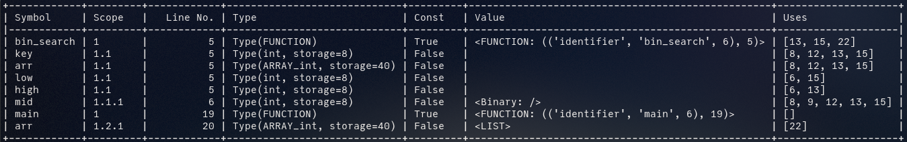
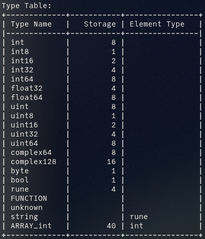
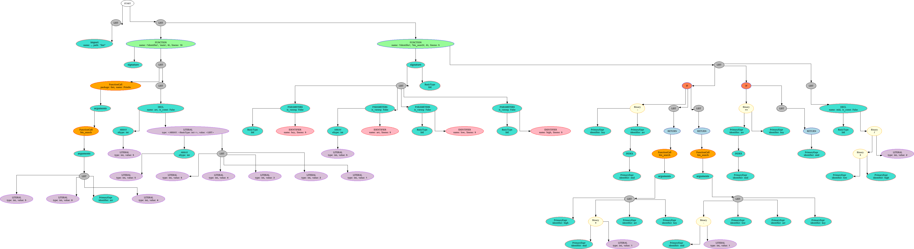

# gopy

A compiler (front-end) for a subset of Go written in Python (PLY)

<sub>Developed as part of the project for the course "Compiler Design" (UE18CS351) at PES University</sub>

## Features

<sub>GoPy was made for academic purposes - specifically to learn compiler design - and should not be used as a real compiler.</sub>

### Language Support

The grammar has been adapted from the [Go Language Specification](https://golang.org/ref/spec) (converted from EBNF to BNF). The following features of Go are supported:

 - Package declaration
 - Global declarations - `var` and `const`
 - Functions (and recursion)
 - Variable declarations - `var`, `const` and short variable declaration
 - Binary operations (not all of them) - arithmetic, conditional and logical
 - If statements
 - For loops - all forms except `range` expression
 - Arrays and slices
 - Type inference (limited) - types in assignment, declarations and binary expressions are inferred

The following features of Go are NOT supported: struct, pointer, interface, map, channel, goroutines, functions as variables, function argument matching, conversions, range for, switch, goto, defer, package imports, etc.

### Symbol Table

The symbol table keeps track of all declared variables and functions. Whenever a symbol is encountered, say a variable has been used in an expression, it is looked up in the symbol table to ensure that it is declared and to get its type (for type inference).

The generated symbol table stores the symbol name, scope, line number (of declaration), etc. Here is the symbol table for [`binary_search.go`](./tests/binary_search.go)



### Type Table

The type table keeps track of all in-built and user defined types. It is currently used to store pre-defined types (such as `int`, `float64`, etc.) and array types (such as array of `int`s, slice of `int`s, etc.). It can be extended to store structs as well as custom types defined by `typedef` and aliases.

In the following type table for [`binary_search.go`](./tests/binary_search.go), `ARRAY_int` denotes an array of `int`s.



### Abstract Syntax Tree (AST)

The parser generates an abstract representation of the source code in the form of a tree, an abstract syntax tree (AST). This AST is used in the subsequent phases to generate the intermediate code.

In GoPy, the AST is drawn using Graphviz. The AST is automatically generated and saved on disk (as `ast.dot` and `ast.png`) when GoPy is run on a Go file. Here is the generated AST for [`binary_search.go`](./tests/binary_search.go) (click to enlarge)


## Intermediate Code

The intermediate code is generated in Three Address Code (TAC) form (internally represented as a list of quadruples). No specific language or syntax is used.

Here is the generated TAC of [`binary_search.go`](./tests/binary_search.go)
<details>
<summary>Click to expand TAC</summary>

```
LABEL FUNCTION_bin_search:
t1 = low + high
t2 = t1 / 2
mid = t2
t3 = base(arr)
t4 = mid * 8
t5 = t3 + t4
t6 = arr [] t5
t7 = t6 == key
if t7 goto if_true_1 else goto if_false_1
LABEL if_true_1:
return mid
LABEL if_false_1:
t8 = base(arr)
t9 = mid * 8
t10 = t8 + t9
t11 = arr [] t10
t12 = key > t11
if t12 goto if_true_2 else goto if_false_2
LABEL if_true_2:
t13 = mid + 1
push high
push t13
push arr
push key
t14 = call FUNCTION_bin_search
return t14
LABEL if_false_2:
t15 = mid - 1
push t15
push low
push arr
push key
t16 = call FUNCTION_bin_search
return t16
LABEL FUNCTION_END_bin_search:
LABEL FUNCTION_main:
arr = {5, 4, 3, 2, 1}
push 5
push 0
push arr
push 4
t17 = call FUNCTION_bin_search
push t17
t18 = call FUNCTION_fmt__Println
LABEL FUNCTION_END_main:
```
</details>

### Intermediate Code Optimization

The generated IC is optimized using several techniques:

 - **Constant Folding** - constant expressions are evaluated and the value is stored instead.
 - **Constant Propagation** - if variables have constant values, their value is substituted instead of the variable name.

    <table>
    <tr>
    <th> Before </th>
    <th> After </th>
    </tr>
    <tr>
    <td>

    ```
    t1 = 20 / 2
    t2 = 10 + t1
    a = t2
    t3 = 13 - 12
    t4 = t3 * 5
    b = t4
    c = 2 >= 1
    t5 = 15 - 1
    t6 = 14 == t5
    d = t6
    e = 1 != 1
    f = false
    t7 = 16 / 4
    c = t7
    return a
    t8 = a + b
    return t8
    ```

    </td>
    <td>

    ```
    t1 = 10
    t2 = 20
    a = 20
    t3 = 1
    t4 = 5
    b = 5
    c = true
    t5 = 14
    t6 = true
    d = true
    e = false
    f = false
    t7 = 4
    c = 4
    return a
    t8 = 25
    return t8
    ```

    </td>
    </tr>
    </table>
 - **Loop-invariant code motion** - if statement produces the same value in every iteration of the loop, it can be hoisted outside the loop. Note that a very conservative version that only looks locally inside a loop is implemented here.

    Before:
    ```
    i = 0
    LABEL for_simple_start_1:
    if true goto for_simple_true_1 else goto for_simple_end_1
    LABEL for_simple_true_1:
    a = 5           <-- loop invariant
    b = a + 10      <-- loop invariant
    i = i + 1
    goto for_simple_start_1
    LABEL for_simple_end_1:
    ```

    After:
    ```
    i = 0
    a = 5           <-- moved outside loop
    b = 15          <-- moved outside loop and constant propagated and folded
    LABEL for_simple_start_1:
    if true goto for_simple_true_1 else goto for_simple_end_1
    LABEL for_simple_true_1:
    i = i + 1
    goto for_simple_start_1
    LABEL for_simple_end_1:
    ```
 - **Strength reduction** - Multiplication and divide by powers of 2 is replaced by bit-shift operations.

    <table>
    <tr>
    <th> Before </th>
    <th> After </th>
    </tr>
    <tr>
    <td>

    ```
    b = 4 * a
    c = a * 8
    d = a / 2
    ```

    </td>
    <td>

    ```
    b = a << 2
    c = a << 3
    d = a >> 1
    ```

    </td>
    </tr>
    </table>
 - **Algebraic identities** - such as addition of 0, multiplication by 0 or 1, etc. are either removed or replaced by the constant value.

    <table>
    <tr>
    <th> Before </th>
    <th> After </th>
    </tr>
    <tr>
    <td>

    ```
    a = x + 0
    b = 0 + x
    c = x * 0
    d = 0 * x
    e = 0 / x
    f = 1 + x
    g = x + 1
    t1 = a + b
    ```

    </td>
    <td>

    ```
    a = x
    b = x
    c = 0
    d = 0
    e = 0
    f = 1 + x
    g = x + 1
    t1 = a + b
    ```

    </td>
    </tr>
    </table>

 - **Copy propagation** - when a variable is copied `x = y`, the subsequent uses of `x` are replaced by `y` if `x` has not been changed before it. This can reduce the number of variables.

    <table>
    <tr>
    <th> Before </th>
    <th> After </th>
    </tr>
    <tr>
    <td>

    ```
    a = a
    b = b
    c = c
    q = b
    r = q * q
    q = a
    s = q * c
    ```

    </td>
    <td>

    ```
    r = b * b
    s = a * c
    ```

    </td>
    </tr>
    </table>

 - **Dead code elimination** - dead code such as unused variables and statements after a return are removed.

    Before:
    ```
    LABEL FUNCTION_something:
    t1 = a < 5
    if t1 goto if_true_1 else goto if_false_1
    LABEL if_true_1:
    return true
    t2 = 25 + 60         <-- dead code
    a = t2               <-- dead code
    LABEL if_false_1:
    return false
    b = 2 * 6            <-- dead code (inside else, after return)
    t3 = b + 1           <-- dead code (inside else, after return)
    a = t3               <-- dead code (inside else, after return)
    arg = 20              <-- outside if-else, NOT dead code
    arg2 = 30            <-- dead code (unused var)
    push arg
    t4 = call FUNCTION_fmt__Println
    return true
    return false         <-- dead code (exists after return)
    LABEL FUNCTION_END_something:
    LABEL FUNCTION_main:
    abc = 10
    bcd = abc            <-- dead code (unused variable)
    push abc
    t5 = call FUNCTION_something
    return abc
    push bcd             <-- dead code (exists after return)
    t6 = call FUNCTION_fmt__Println   <-- dead code (exists after return)
    LABEL FUNCTION_END_main:
    ```

    After:
    ```
    LABEL FUNCTION_something:
    t1 = a < 5
    if t1 goto if_true_1 else goto if_false_1
    LABEL if_true_1:
    return true
    LABEL if_false_1:
    return false
    arg = 20
    push arg
    t4 = call FUNCTION_fmt__Println
    return true
    LABEL FUNCTION_END_something:
    LABEL FUNCTION_main:
    abc = 10
    push abc
    t5 = call FUNCTION_something
    return abc
    LABEL FUNCTION_END_main:
    ```

## Usage

0. (optional) create and activate a virtual environment: `python -m venv env` and `source env/bin/activate`
1. Install the requirements: `pip install -r requirements.txt`
2. Run GoPy: `python go_parser.py .\tests\filename.go`

This will generate the following:
 - **AST (Abstract Syntax Tree)**
    - `ast.dot` in Graphviz format (best viewed in Dot format, not Neato)
    - `ast.png` the above in PNG format, if you don't have a Dot file viewer
    - `syntax_tree.txt` in ASCII text format
 - **Symbol Table**
    - printed in the terminal
    - printed in the file `symbol_table.txt`
 - **Type Table**
    - printed in the terminal
 - **Intermediate Code**
    - In a table of Quads (as in the Quadruple format)
    - In three address code (TAC) format
    - Both in terminal
 - **Optimized Intermediate Code**
    - Same as above

## Code Structure

 - [`./tests`](./tests): files to test the compiler on. All files may not work. [`./tests/binary_search.go`](./tests/binary_search.go) should work.
 - [`./ply`](./ply): the source code of [PLY](https://github.com/dabeaz/ply) is here (as suggested in their documentation)
 - [`./go_lexer.py`](./go_lexer.py)
 - [`./go_parser.py`](./go_parser.py): contains the grammar rules with appropriate SDDs to generate AST. This also calls AST optimizer, exports, IC generator, etc.
 - [`./syntree.py`](./syntree.py): everything related to the AST. Contains a class hierarchy of nodes as well as some semantic analysis. Also has a rudimentary AST optimizer.
 - [`./symbol_table.py`](./symbol_table.py): contains Symbol Table and Type Table
 - [`./utils.py`](./utils.py): some utilities for pretty printing errors, etc.
 - [`./tree_vis.py`](./tree_vis.py): to visualize the AST in Graphviz/dot format. Uses the [`pydot`](https://pypi.org/project/pydot/) library and performs a post-order traversal of the AST to generate the graph.
 - [`./pptree_mod.py`](./pptree_mod.py): modified version of the main file of the [`pptree`](https://pypi.org/project/pptree/) package to add support for custom name attribute.
 - [`./tac.py`](./tac.py): Intermediate Code generator (ICG) in Three Address Code (TAC) form using Quadruples. Uses the AST to generate the IC through a combination of pre and post-order traversal.
 - [`./ico.py`](./ico.py): Intermediate Code Optimizer (ICO)
